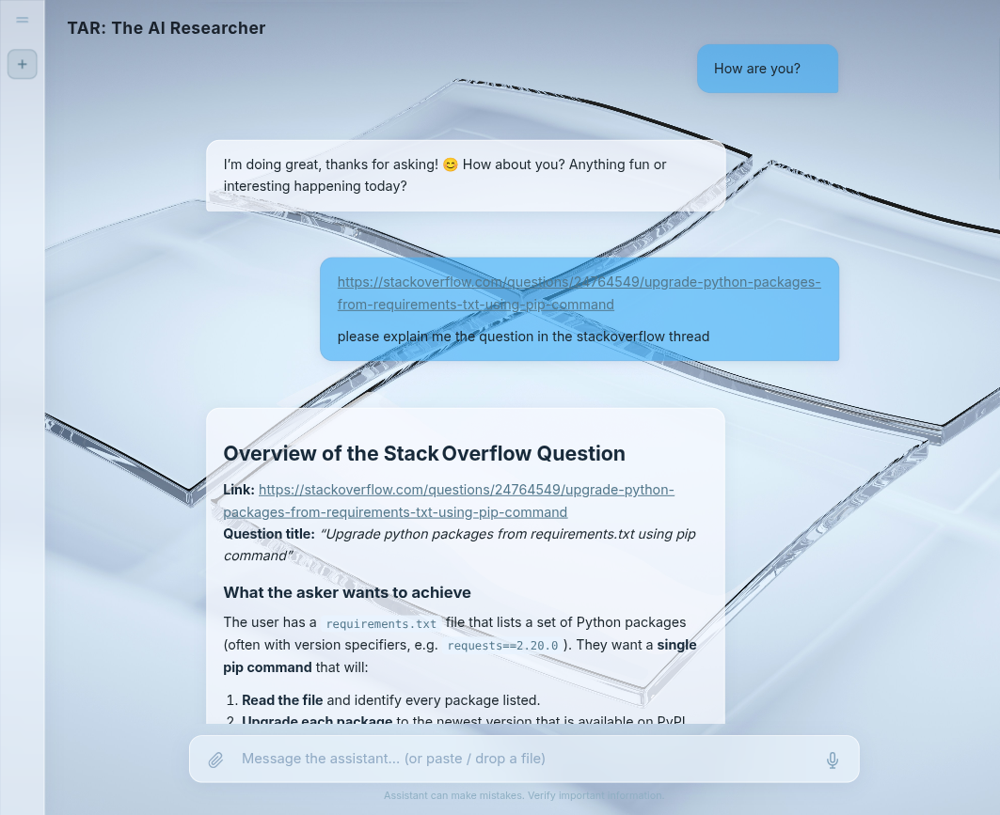
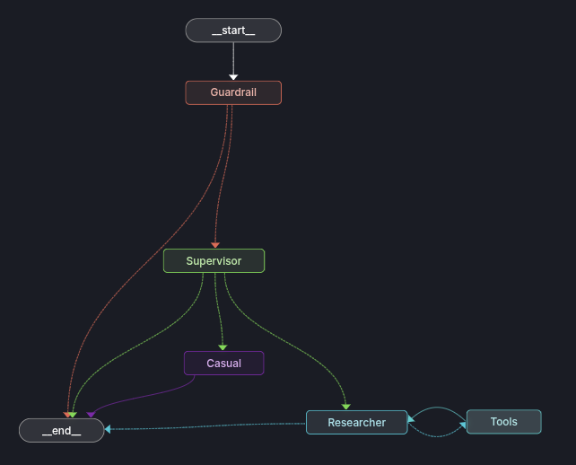

# TAR: The AI Researcher

> **High-Level Value Prop**: TAR (The AI Researcher) is an advanced, multi-agent AI system designed to conduct deep, autonomous internet research and process multi-modal attachments (PDFs, Images, Audio). By leveraging a robust, event-driven graph architecture, TAR provides highly accurate, context-aware, and thoroughly researched responses, minimizing hallucinations and maximizing depth.

<p align="center"></p>

---

## 🏗️ Entire System Design (User Flow)

The infrastructure follows a modular, serverless-friendly design combining a Vue front-end with a stateful Python backend, secured by external Auth providers and accelerated by specialized LLM clusters.

1. **User Interface (Vue 3)**: A user navigates to the Vercel-hosted frontend or local server. The `App.vue` checks authentication status via `supabase.js`. The user initiates a request (with or without attachments) to the `InputArea.vue`.
2. **Payload Transmission**: The frontend hits the backend's `/api/chat` route (served by FastAPI in `main.py`). If an image, audio, or PDF file is provided, it is securely transmitted to the server.
3. **Memory & State Retrieval**: Over in the backend, `middlewares.py` and the `SessionMemoryManager` jump in. Using the session ID, the memory manager pulls down any required conversational context from **Supabase** (acting as long-term memory) and loads it into a rapid TTL cache.
4. **LangGraph Execution (The Brain)**: The request is pushed into the compiled LangGraph execution loop defined in `builder.py`.
5. **LLM Invocations**: Nodes within the graph ping the `get_llm()` mappings from `llms.py`. Simple logic functions are routed to instantaneous models like Groq Llama/Qwen MoEs, while heavy parsing might route to Google GenAI for massive context ingestion.
6. **Delivery & Persistence**: Once the graph yields the final output, the text streams back to the frontend. The `ChatWindow.vue` interprets markdown tables, KaTeX algorithms, and syntax-highlighted code blocks dynamically. In the background, `memory_manager.py` syncs the new dialog turn back up to Supabase.

---

## 🧠 Agentic Workflow

TAR’s intelligence relies on continuous evaluation and tool use, breaking away from linear generation loops.

1. **Guardrail Check**: Every message hits `guardrail.py` to filter malicious intents or system jailbreaks.
2. **The Supervisor Router**: `supervisor.py` intercepts the query.
   - *If an attachment exists*, the Supervisor forces routing to the **Researcher**.
   - *If no attachment exists*, it deduces whether the query is conversational (routes to **Casual**) or complex (routes to **Researcher**).
3. **The Researcher loop**: `researcher.py` looks at the state. Based on the file attached, it is dynamically granted access to `pdf_extractor_tool`, `image_extractor_tool`, or `audio_extractor_tool`.
4. **Information Gathering**: The Researcher autonomously determines if it needs internet context using `tavily_search` or `tavily_extract`, or if it should analyze the attached files using its vision/audio/parsing tools.
5. **Synthesis**: Once the Researcher has accumulated all necessary context, it executes the `writer_tool.py`—providing strict guidelines on what tone to use, what data to leverage, and what final layout to construct.

### 🛠️ Agent Tools Overview

The Researcher agent employs a dynamically bound set of tools based on the user's explicit request and the attached context:

- **`tavily_search`**: The primary web navigation tool. Used to natively search the internet for exact answers, verified news, or academic context.
- **`tavily_extract`**: The deep-dive crawler. Used after a search when the agent identifies a specific URL that it needs to read entirely.
- **`pdf_extractor_tool`**: Assigned dynamically when a user uploads a `.pdf`. Parses dense document text using Gemini Flash and chunk-wise LLM evaluations.
- **`image_extractor_tool`**: Assigned dynamically when a user uploads images (`.jpg`, `.png`, etc). Leverages Groq-hosted MoE Llama Vision models to answer visual questions or transcribe text from pictures.
- **`audio_extractor_tool`**: Assigned dynamically when a user uploads audio (`.mp3`, `.wav`). Streams the file to Groq's Whisper-v3 model for instant transcription and analysis.
- **`writer_tool`**: The final formatting tool. The Researcher is forced to call this tool once it finishes its investigation, instructing the writer on exactly what to output.

<p align="center">

</p>

---

## 📁 Directory Tree

```text
The-AI-Researcher/
├── README.md                        ## Main project documentation
├── requirements.txt                 ## Python dependencies
├── environment.yml                  ## Conda environment configuration
├── deploy.sh                        ## Shell script for automated PM2 production deployments
├── src/                             ## Backend Source Code (Python/FastAPI/LangGraph)
│   ├── main.py                       # FastAPI application entry point; exposes /api/chat
│   ├── middlewares.py                # CORS and request interception logic
│   ├── graph/                        # Core Agentic Logic & State Machine
│   │   ├── builder.py                  # LangGraph configuration, nodes setup, and edge routing
│   │   ├── llms.py                     # LLM initialization (Groq, Google GenAI) mapped by capability
│   │   ├── prompts.py                  # System prompts managing personality and strict AI constraints
│   │   ├── state.py                    # LangGraph AgentState typing definitions
│   │   └── nodes/                      # Individual Agent Nodes
│   │       ├── casual.py                # Handles simple chitchat
│   │       ├── guardrail.py             # First-pass moderation and prompt injection protection
│   │       ├── researcher.py            # The master agent coordinating tool usage and file analysis
│   │       └── supervisor.py            # The Router; judges intent and delegates tasks
│   ├── tools/                        # Agent Capabilities
│   │   ├── file_extractors.py          # Wraps PDF, Vision, and Whisper extraction logic for attachments
│   │   ├── search.py                   # Internet access via Tavily/DuckDuckGo
│   │   └── writer_tool.py              # Used by Researcher to synthesize final output
│   └── utils/                        # Helper Modules
│       ├── context.py                  # Chat history trimming and optimization
│       ├── logger.py                   # Standardized application logging
│       ├── memory_manager.py           # Local TTL caching & Supabase synchronization
│       ├── pdf.py                      # PDF PyMuPDF text parsing helper
│       └── storage_cleanup.py          # Cleans up temporary files generated during requests
└── frontend/                        ## Frontend Source Code (Vue 3/Vite)
    ├── index.html                    # Vue app entry point
    ├── package.json                  # Node dependencies
    ├── vite.config.js                # Vite build and proxy settings
    └── src/
        ├── App.vue                     # Root component: manages layout, auth state, and dynamic routing
        ├── main.js                     # Vue initialization
        ├── style.css                   # Global design system and layout constraints
        ├── supabase.js                 # Supabase client instantiation
        └── components/                 # Reusable UI Elements
            ├── AuthModal.vue            # Email/Password login flows
            ├── ChatWindow.vue           # Renders markdown, KaTeX math, and conversation bubbles
            ├── ConversationSidebar.vue  # Fetches and lists historical chat sessions
            └── InputArea.vue            # Handles local file uploads, text entry, and submission
```

---

## 🏛️ Infrastructure: Oracle Cloud (OCI) - E2.1.Micro

**Status:** Production Live (HTTPS Secured)

### 1. Executive Summary

This report documents the end-to-end deployment of "The AI Researcher," a full-stack AI agent. The primary challenge was engineering a stable environment within the constraints of a free-tier virtual machine (1GB RAM) while ensuring secure, high-speed communication between a Vercel-hosted frontend and an OCI-hosted FastAPI backend.

### 2. The Infrastructure Stack (Zero-Cost Architecture)

- **Compute:** Oracle Cloud E2.1.Micro (1 OCPU, 1GB RAM, x86_64).
- **OS:** Ubuntu 22.04 LTS.
- **Networking:** DuckDNS (Dynamic DNS) for a custom domain.
- **Security:** Let’s Encrypt (Certbot) for SSL/TLS termination.
- **Web Server:** Nginx (Reverse Proxy).
- **Process Manager:** PM2 (Node-based process management for Python).
- **Persistence:** Supabase (PostgreSQL + Auth).
- **Inference:** Groq API & Google GenAI (External).

### 3. Deployment Strategy

#### A. Memory Stabilization (The Swap Hack)

The E2.1.Micro instance has only 1GB of physical RAM, which is insufficient for Python's memory spikes during dependency installation or AI processing.
**Solution:** We allocated a 4GB Swap File on the SSD. This allowed the system to use disk space as "emergency RAM," preventing the server from freezing during `pip install` or heavy API traffic.

#### B. Process Management

To ensure 24/7 uptime, we utilized PM2.
**Strategy:** PM2 monitors the FastAPI process. If the application crashes or the server reboots, PM2 automatically restarts the backend in milliseconds.
**Uvicorn Tuning:** We configured Uvicorn with `limit_max_requests=500` and `workers=1` to recycle memory frequently and stay within the strict CPU limits.

#### C. The Reverse Proxy (Nginx)

Nginx was configured to handle the "Front Door" of the server. It manages SSL encryption (HTTPS) and routes traffic:

- Static files/Frontend requests are handled at the root `/`.
- API requests are proxied internally to `localhost:8000`.

---

## 💻 Getting Started Commands

**Backend:**

```bash
python -m venv venv # ensure >=python3.11
source venv/bin/activate
pip install -r requirements.txt
cp .env.example .env # Configure keys
python src/main.py
```

**Frontend:**

```bash
cd frontend
npm install
npm run dev
```

**Deployment (PM2):**

```bash
# Start backend using PM2
pm2 start "python src/main.py" --name "ai-researcher-backend"

# Save PM2 process list so it restarts on boot
pm2 save
pm2 startup
```

*"I am activly working on this project and will be updating it as I go."*
